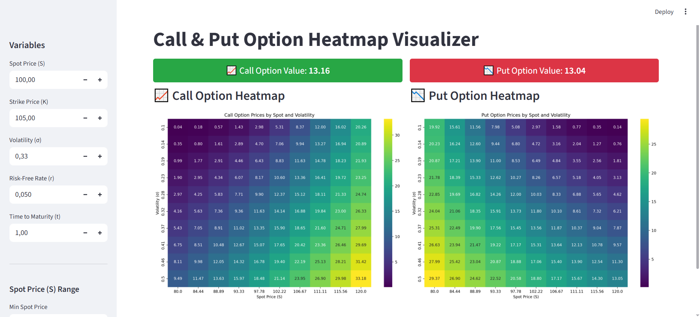

# 📈 Call & 📉 Put Option Heatmap Visualizer

A simple and interactive web application built with [Streamlit](https://streamlit.io/) that visualizes the value of **European Call and Put Options** over a range of spot prices and volatilities using heatmaps. The app also displays the calculated option values for a fixed set of parameters with a clean interface.

---

## 🚀 Features

- 🎛 Adjustable inputs for:
  - Strike Price (K)
  - Risk-Free Rate (r)
  - Time to Maturity (t)
  - Spot Price range (Smin to Smax)
  - Volatility range (σmin to σmax)
- ✅ Highlighted **Call** and **Put** option values for a **fixed** spot price and volatility
- 📊 Two interactive heatmaps for call and put values
- 💡 Simple UI with live updates as parameters change

---

## 📷 Screenshot

  
> Example heatmaps showing call and put option values over spot price and volatility

---

## 🧠 How it Works

The application uses the **Black-Scholes** model to calculate the prices of European Call and Put options.

### Call Option Formula:

C = S · N(d₁) – K · e^(–rt) · N(d₂)

### Put Option Formula:

P = K · e^(–rt) · N(–d₂) – S · N(–d₁)

where:

- \( d_1 = \frac{\ln(S/K) + (r + \sigma^2/2)t}{\sigma \sqrt{t}} \)
- \( d_2 = d_1 - \sigma \sqrt{t} \)

---

## 🛠️ Tech Stack

- **Python**
- **Streamlit** for the interactive web UI
- **Matplotlib** for plotting the heatmaps
- **SciPy** for the cumulative normal distribution (`scipy.stats.norm`)

---

